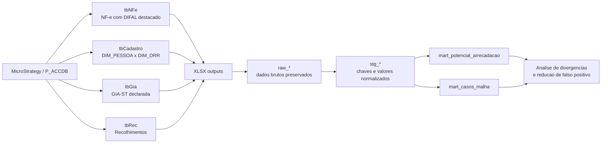
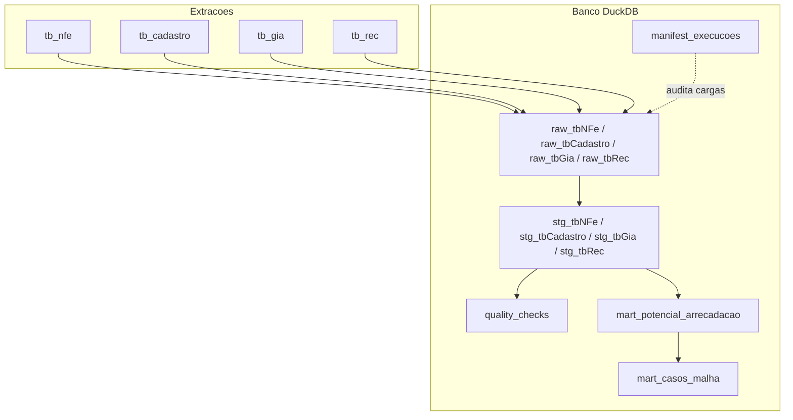
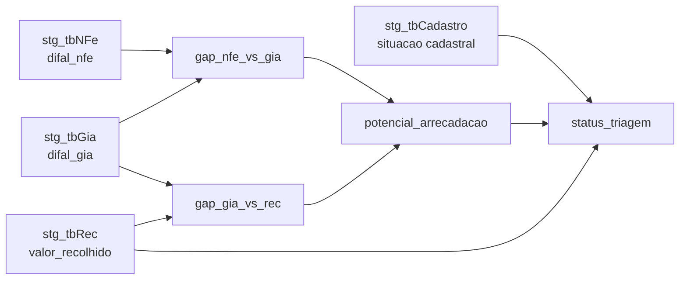
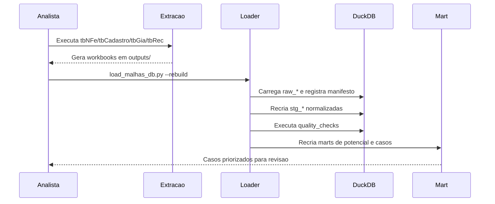

# Projeto Malhas Agent - DIFAL EC 87/2015

> Base local em DuckDB para cruzar documentos fiscais, cadastro, GIA-ST e recolhimentos, apoiando a selecao de casos com potencial de autorregularizacao.

## Visao Geral

Este workspace converte as extracoes MicroStrategy em uma base analitica leve, auditavel e reprocessavel. A primeira fase do projeto ainda e exploratoria: o objetivo e medir viabilidade da malha, entender divergencias e reduzir falsos positivos antes de construir uma ferramenta de analise mais completa.

As fontes seguem a nomenclatura do documento do Estevao:

| Fonte | Papel na malha | Status atual |
| --- | --- | --- |
| `tbNFe` | Valores de DIFAL destacados em documentos fiscais, agregados por emitente | Implementada e carregavel |
| `tbCadastro` | Contribuintes com inscricao estadual no Parana, DRR 17 e IE-ST | Workspace implementado; depende de executar a extracao |
| `tbGia` | Valores declarados em GIA-ST no campo `VL_ICMS_DIFAL` | Implementada e carregavel |
| `tbRec` | Recolhimentos efetuados no periodo | Implementada e carregavel |
| `extracao_4` / `extracao_5` | Proximas extracoes ainda nao detalhadas | Slots preparados |

## Arquitetura





## Como Operar

### 0. Iniciar o módulo gerencial

```powershell
uv run python malhas_agent/manage_app.py init-db
uv run python malhas_agent/manage_app.py create-user --username admin --role admin
uv run streamlit run malhas_agent/app.py
```

A interface abre a tela `Análise de Itens`, com login multiusuário, consulta aos maiores potenciais, filtros fiscais, exportação de amostra para Excel e cadastro de achados determinísticos ou hipóteses não determinísticas.

A navegação segue o perfil do usuário:

- `admin`: acessa `Painel`, `Análise de Itens` e `Administração`; gerencia usuários, parâmetros de lote, regras e diagnóstico.
- `analista`: acessa painel e análise; pode criar regras candidatas e hipóteses.
- `leitor`: acessa painel e análise somente para consulta.

Para publicar a interface para o Estevao em outra maquina da rede:

```powershell
.\malhas_agent\start_app_rede.ps1
```

Endereco atual nesta maquina:

```text
http://10.14.0.226:8501
```

Se o acesso remoto falhar, execute em PowerShell como Administrador:

```powershell
New-NetFirewallRule -DisplayName "Ageste Difal Streamlit 8501" -Direction Inbound -Action Allow -Protocol TCP -LocalPort 8501 -Profile Domain,Private
```

### 1. Validar plano de carga sem alterar o banco

```powershell
uv run python malhas_agent/load_malhas_db.py --dry-run --source-dir .
```

Use este comando para confirmar quais arquivos o agente espera encontrar. Fontes ausentes podem existir normalmente durante a fase inicial; elas serao registradas como `missing` quando a carga real rodar.

### 2. Executar ou reexecutar as extracoes

`tbNFe` usa chunk temporal com fallback mensal, 15 dias e 7 dias:

```powershell
uv run python tb_nfe/download_tb_nfe.py --dry-run
uv run python tb_nfe/download_tb_nfe.py
```

`tbCadastro` e um snapshot unico, sem recorte temporal:

```powershell
uv run python tb_cadastro/download_tb_cadastro.py --dry-run
uv run python tb_cadastro/download_tb_cadastro.py
```

`tbGia` e `tbRec` ja estao implementadas. O loader espera os arquivos:

| Fonte | Arquivo esperado |
| --- | --- |
| `tbGia` | `tb_gia/outputs/tb_gia_2022-04-01_a_2025-12-31.parquet` |
| `tbRec` | `tb_rec/outputs/tb_rec.parquet` |

### 3. Reconstruir o banco local

```powershell
uv run python malhas_agent/load_malhas_db.py --rebuild --source-dir .
```

Este comando remove o banco DuckDB atual, carrega novamente os workbooks existentes, recria staging, marts e checks de qualidade.

### 4. Carregar apenas uma fonte

```powershell
uv run python malhas_agent/load_malhas_db.py --only tbNFe --source-dir .
uv run python malhas_agent/load_malhas_db.py --only tbCadastro --source-dir .
```

Use quando apenas uma extracao foi atualizada. Depois da carga, o script recria os stagings, marts e checks.

### 5. Rodar somente checks e marts sobre o banco atual

```powershell
uv run python malhas_agent/load_malhas_db.py --quality-checks
```

Use depois de inspecoes manuais ou quando quiser recalcular as visoes analiticas sem recarregar XLSX.

## Banco Local

O arquivo padrao do banco fica em:

```text
malhas_agent/db/malhas.duckdb
```

Ele e ignorado pelo Git para evitar versionar dado operacional.

### Camadas

| Camada | Tabelas | Finalidade |
| --- | --- | --- |
| Controle | `manifest_execucoes`, `quality_checks` | Auditoria de cargas e validacoes |
| Raw | `raw_tbNFe`, `raw_tbCadastro`, `raw_tbGia`, `raw_tbRec` | Preservar os dados exatamente como vieram do arquivo de origem |
| Staging | `stg_tbNFe`, `stg_tbCadastro`, `stg_tbGia`, `stg_tbRec` | Normalizar chaves, converter valores e preparar joins |
| Marts | `mart_potencial_arrecadacao`, `mart_casos_malha` | Visao de cruzamento e priorizacao dos casos |
| Futuras | `raw_extracao_4`, `stg_extracao_4`, `raw_extracao_5`, `stg_extracao_5` | Slots para proximas bases |
| Gestão | `app_users`, `param_lotes`, `lotes_analise`, `lote_casos`, `regras_malha`, `regra_eventos` | Usuários, parâmetros, lotes e regras |
| Itens | `raw_tbNFeItens`, `stg_tbNFeItens`, `mart_itens_*` | Análise em nível de item para derivar regras |

### Principais Chaves Normalizadas

| Campo | Origem | Uso |
| --- | --- | --- |
| `cnpj_norm` | CNPJ limpo, somente digitos | Cruzamento principal entre NF-e, cadastro e GIA |
| `cnpj_cpf_norm` | `NU_CNPJ_CPF` limpo | Identificador canonico do cadastro |
| `ie_norm` | Inscricao estadual limpa | Apoio para cruzamento com recolhimentos |
| `ie_st_norm` | IE-ST limpa | Apoio para cadastro e GIA-ST |
| `inscricao_norm` | `CD_INSCRICAO_CNPJ_CPF` limpo | Chave conservadora de `tbRec` |
| `chave_cnpj_ie_st` | `NU_CNPJ_CPF + NU_IE_ST` | Chave canonica inicial de `tbCadastro` |

## Regras Analiticas Atuais



Indicadores calculados:

| Campo | Descricao |
| --- | --- |
| `difal_nfe` | DIFAL destacado em NF-e, vindo de `tbNFe` |
| `difal_gia` | DIFAL declarado em GIA-ST, vindo de `tbGia` |
| `valor_recolhido` | Valor recolhido, vindo de `tbRec` |
| `gap_nfe_vs_gia` | Diferenca entre destaque em NF-e e declaracao em GIA-ST |
| `gap_gia_vs_rec` | Diferenca entre declaracao em GIA-ST e recolhimento |
| `potencial_arrecadacao` | Maior divergencia positiva entre NF-e/GIA e recolhimento |
| `sinais_falso_positivo` | Alertas textuais para revisao manual |
| `status_triagem` | Classificacao inicial do caso |
| `score_priorizacao` | Escore simples por faixa de potencial |

Os sinais de falso positivo iniciais consideram cadastro ausente, contribuinte baixado, recolhimento localizado, CNPJ ausente e IE-ST ausente.

### Análise de Itens

A tela `Análise de Itens` trabalha sobre `stg_tbNFeItens` e seus marts. Ela permite filtrar por contribuinte, período, `NCM`, `CEST`, `CFOP`, `CST`, descrição, GTIN e valor mínimo de DIFAL. Os agrupamentos principais são `NCM + CFOP + CST`, descrição e emitente.

A base `stg_tbNFeItens` deve ser carregada pela extração dos itens apenas dos contribuintes selecionados no top da `tbNFe`, não por uma extração completa de todos os itens:

```powershell
uv run python tb_nfe/download_tb_nfe_itens_top.py --top-n 20
uv run python malhas_agent/load_malhas_db.py --only tbNFeItens --source-dir .
```

Pela interface, o administrador deve preferir o fluxo guiado em `Administração > Parâmetros de Lote`: ativar um parâmetro com `Top N`, clicar em `Carregar itens do lote ativo`, revisar falsos positivos na tela `Análise de Itens`, recarregar para completar o top e, ao final, marcar o lote como autorregularização.

O botão `Desfazer último ato desta sessão` reverte ações feitas na sessão atual e mantém auditoria em `admin_action_events`.

Os achados podem ser salvos como:

| Tipo | Uso |
| --- | --- |
| `deterministica` | Regras aplicáveis diretamente sobre filtros estruturados dos itens |
| `nao_deterministica` | Hipóteses externas aos documentos fiscais, como regime especial, convênio, legislação ou exceção a pesquisar pelo agente |

As hipóteses não determinísticas não exigem filtros estruturados; elas guardam texto livre, referência externa e evidência para a automação futura.

## Detalhamento das Funcoes

As funcoes abaixo ficam em `malhas_agent/load_malhas_db.py`.

| Funcao | O que faz |
| --- | --- |
| `SourceSpec` | Define o contrato de cada fonte: nome logico, tabela raw, tabela staging, arquivo esperado e abas do workbook |
| `_now_iso()` | Retorna timestamp UTC padronizado para manifesto e checks |
| `_qident(identifier)` | Protege nomes de tabelas/colunas com aspas para SQL DuckDB |
| `_digits_expr(column)` | Gera expressao SQL que remove tudo que nao for digito |
| `_money_expr(column)` | Gera expressao SQL para converter textos monetarios com virgula ou ponto em `DOUBLE` |
| `_file_hash(path)` | Calcula SHA-256 do arquivo carregado, permitindo auditar se a fonte mudou |
| `_read_workbook_rows(path, prefixes)` | Le as abas do Excel cujo nome inicia por `chunks`; se nao encontrar, usa a primeira aba |
| `_read_parquet_rows(path)` | Le arquivos Parquet, usados para extracoes grandes como `tbGia` |
| `_read_source_rows(path, prefixes)` | Escolhe automaticamente o leitor conforme a extensao do arquivo |
| `_table_exists(conn, table_name)` | Verifica se uma tabela existe no DuckDB |
| `_table_columns(conn, table_name)` | Retorna as colunas atuais de uma tabela |
| `_has_columns(conn, table_name, columns)` | Confirma se a tabela possui o conjunto minimo de colunas esperado |
| `_ensure_empty_raw_table(conn, table_name)` | Cria uma tabela raw vazia quando o arquivo de origem ainda nao existe |
| `_register_manifest(...)` | Registra cada carga em `manifest_execucoes`, incluindo status, arquivo, hash, linhas e erro |
| `create_control_tables(conn)` | Cria `manifest_execucoes` e `quality_checks` se ainda nao existirem |
| `load_source(conn, spec, source_file)` | Carrega Excel ou Parquet em tabela raw, adicionando `run_id`, `source_file` e `loaded_at` |
| `_create_empty_staging(conn, table_name, columns)` | Cria staging vazio quando a raw ainda nao tem dados suficientes |
| `rebuild_staging_tables(conn)` | Recria todas as `stg_*`, normalizando chaves e valores para cruzamento |
| `rebuild_marts(conn)` | Recria `mart_potencial_arrecadacao` e `mart_casos_malha` |
| `run_quality_checks(conn, run_id=None)` | Executa validacoes de chaves ausentes, duplicidades e valores negativos |
| `build_parser()` | Define os argumentos da CLI |
| `_spec_with_source_dir(spec, source_dir)` | Reaponta arquivos esperados para uma raiz alternativa de workspaces |
| `main(argv=None)` | Orquestra dry-run, rebuild, carga seletiva, staging, marts e checks |

## Workspaces de Extracao

### `tbNFe`

Local: `tb_nfe/`

Responsavel por extrair documentos fiscais com DIFAL destacado. Como a consulta pode ser grande, roda em chunks de tempo e consolida localmente por emitente.

Principais funcoes em `download_tb_nfe.py`:

| Funcao | O que faz |
| --- | --- |
| `dry_run_plan(...)` | Mostra SQL, datas, output e cadeia de chunks sem conectar ao MicroStrategy |
| `run_tb_nfe_export(...)` | Executa a extracao com fallback mensal, 15 dias e 7 dias |
| `_consolidate_chunks(chunks)` | Agrupa por `NmEmit`, `CNPJEmit`, `UFEmit` e soma metricas |
| `_build_top_n(consolidated, top_n)` | Gera recorte de leitura rapida com maiores valores |
| `_write_final_workbook(...)` | Regrava o Excel final com `chunks`, `consolidado`, `top_n` e `manifest` |

### `tbCadastro`

Local: `tb_cadastro/`

Responsavel por extrair o snapshot de `DIM_PESSOA x DIM_DRR` para contribuintes da DRR 17 com IE-ST.

Principais funcoes em `download_tb_cadastro.py`:

| Funcao | O que faz |
| --- | --- |
| `dry_run_plan(...)` | Mostra SQL, output, colunas canonicas e regra de deduplicacao |
| `run_tb_cadastro_export(...)` | Executa snapshot unico via Freeform SQL e pagina todas as linhas |
| `_build_summary(result)` | Resume status, linhas e erros do manifesto |
| `_manifest_error_count(manifest)` | Conta execucoes com erro no manifesto |

### `tbGia`

Local: `tb_gia/`

Responsavel por exportar a GIA-ST declarada em chunks mensais, com fallback para 15 dias e 7 dias. A base completa fica em Parquet; o Excel fica apenas como resumo leve para inspecao.

Principais funcoes em `download_tb_gia.py`:

| Funcao | O que faz |
| --- | --- |
| `dry_run_plan(...)` | Mostra SQL, output, cadeia de chunks e nome do arquivo Parquet sem conectar ao MicroStrategy |
| `run_tb_gia_export(...)` | Executa a extracao com fallback mensal, 15 dias e 7 dias |
| `_consolidate_chunks(chunks)` | Ordena o consolidado por periodo, identificadores e `Difal` |
| `_build_top_n(consolidated, top_n)` | Gera o top_n com `Difal` desc e desempates deterministas |
| `_write_parquet_output(...)` | Grava a base completa em Parquet com compressao `snappy` |
| `_write_summary_workbook(...)` | Grava o Excel resumido com amostra, `top_n` e `manifest` |

### `tbRec`

Local: `tb_rec/`

Responsavel por extrair os recolhimentos de `FAT_GUIA_RECOL`, somando `VL_REC` por `CD_INSCRICAO_CNPJ_CPF` no periodo de `2022-04-05` a `2025-12-31`. A base completa sai em Parquet e o Excel fica apenas como resumo leve.

Principais funcoes em `download_tb_rec.py`:

| Funcao | O que faz |
| --- | --- |
| `dry_run_plan(...)` | Mostra SQL, output e colunas sem conectar ao MicroStrategy |
| `run_tb_rec_export(...)` | Executa snapshot unico via Freeform SQL e pagina todas as linhas |
| `_sort_rec(frame)` | Ordena por `TotalRec` desc e inscrição como desempate |
| `_write_parquet_output(...)` | Grava a base completa em Parquet com compressao `snappy` |
| `_write_summary_workbook(...)` | Grava o Excel resumido com amostra, `top_n` e `manifest` |

### Motor Compartilhado de Snapshot

Local: `src/freeform_snapshot_export.py`

Este modulo e usado por extracoes sem chunk temporal, como `tbCadastro`, e permite reaproveitar login, criacao de relatorio temporario, paginacao e escrita do workbook.

| Funcao | O que faz |
| --- | --- |
| `SnapshotColumnSpec` | Define uma coluna de snapshot como atributo ou metrica |
| `snapshot_attribute(name)` | Cria especificacao de coluna de atributo |
| `snapshot_metric(name)` | Cria especificacao de coluna de metrica |
| `_split_snapshot_columns(columns)` | Separa colunas de saida, atributos e metricas para montar o relatorio Freeform SQL |
| `consolidate_snapshot_rows(...)` | Ordena e deduplica o snapshot conforme colunas canonicas |
| `build_snapshot_top_n(...)` | Gera recorte de leitura rapida |
| `_create_snapshot_report(...)` | Cria o relatorio temporario Freeform SQL no MicroStrategy |
| `_execute_snapshot_once(...)` | Executa o relatorio, pagina dados e retorna DataFrame |
| `run_freeform_sql_snapshot_export(...)` | Orquestra login, tentativas, consolidacao, manifest e escrita do Excel |

O modulo `src/difal_report_chunks.py` continua sendo a base de baixo nivel para comunicacao com MicroStrategy, tratamento de instancias, paginacao, parsing de linhas e escrita padronizada em Excel.

## Consultas Uteis

Abrir o DuckDB via Python:

```powershell
@'
import duckdb

con = duckdb.connect("malhas_agent/db/malhas.duckdb", read_only=True)
print(con.execute("select table_name from information_schema.tables where table_schema='main' order by table_name").fetchall())
print(con.execute("select * from mart_casos_malha order by potencial_arrecadacao desc limit 10").df())
con.close()
'@ | uv run python -
```

Ver manifesto das cargas:

```sql
SELECT source_name, status, rows_loaded, source_file, started_at, finished_at
FROM manifest_execucoes
ORDER BY started_at DESC;
```

Ver maiores potenciais:

```sql
SELECT cnpj_norm, nome_pessoa, difal_nfe, difal_gia, valor_recolhido,
       potencial_arrecadacao, status_triagem, sinais_falso_positivo
FROM mart_casos_malha
ORDER BY potencial_arrecadacao DESC
LIMIT 50;
```

Ver checks com ocorrencia:

```sql
SELECT check_name, table_name, severity, rows_affected, details
FROM quality_checks
WHERE rows_affected > 0
ORDER BY rows_affected DESC;
```

## Fluxo Recomendado de Trabalho



1. Rodar dry-run da extracao que sera atualizada.
2. Executar a extracao MicroStrategy.
3. Conferir se o workbook apareceu em `outputs/`.
4. Rodar `load_malhas_db.py --rebuild --source-dir mstr_downloads`.
5. Consultar `manifest_execucoes` e `quality_checks`.
6. Analisar `mart_casos_malha`.
7. Ajustar regras de falso positivo conforme os achados.

## Estado Atual e Proximos Passos

O que ja esta pronto:

- Extracao `tbNFe` renomeada e carregavel.
- Extracao `tbCadastro` renomeada e pronta para execucao.
- Banco DuckDB local com raw, staging, marts, manifesto e checks.
- Extracoes `tbGia` e `tbRec` implementadas em Parquet.

O que ainda falta:

- Executar `tbCadastro` e `tbRec` para completar os cruzamentos.
- Calibrar `status_triagem`, `score_priorizacao` e `sinais_falso_positivo` com dados reais.
- Evoluir para uma interface de analise quando os marts estiverem validados.
